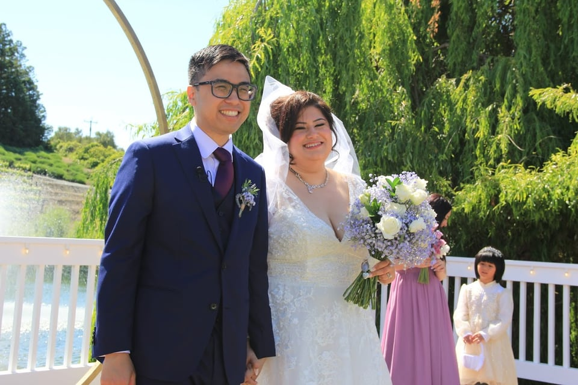

📍 Location: San Jose, CA

It's been a season since the last now post. Besides [getting married](/blog/2024-06-12-newsletter-may-2024-updates/), I've also went on a honeymoon, got COVID, and now re-settling back into my normal routine. This website got changed quite a bit again where the home page is now a feed. I'm still thinking through what I want it to ultimately look like, and you may see more changes soon.

The week notes have been keeping me fresh with new ideas of what will be in store for the future.

Much of my time has been dedicated to playing Baldur's Gate 3 with my wife. We haven't played a lot of D&D, so there's been a learning curve to the possibilities with this game. The world building is very rich.

I've been meaning to write in Camp NaNoWriMo, but it's been hard with the little downtime that I appear to have.
If I review my week notes, it looks like AI, obituaries, productivity tools, and tech have really taken my attention. I've been meaning to cut out the dopamine-filled addictions like social media doomscrolling and replacing it with reading. It always feels like an assault on my senses, especially with the current political upheavals the US has been facing.
