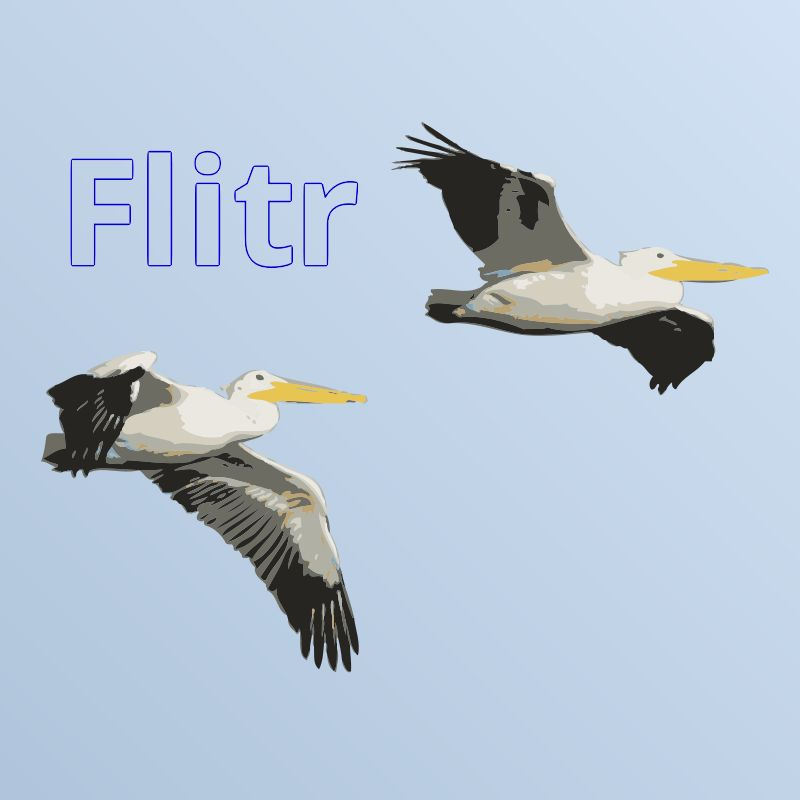

Flight is a social networking playground where users post their profiles and show their pictures.

Defunct - Website is down

## Features

Users can create an account or log-in to do the following:

- update their posts with text or pictures.
- comment on anyone's status
- create statuses (that no one else needs to comment on!)
- be a friend to someone else, no limits!

## Website

[Flitr](https://flitr.herokuapp.com/) (sounds like 'Flirt') is hosted by Heroku and uses Amazon S3.

## Contribute

Want to contribute to our efforts? Email Simon for details.

## Questions?

You have questions, we have answers. Email Simon or Tweet at us and we'll get back to you.

## License

Our team consists of Simon, Quy, Lienha, & Jeremy. This program is under an MIT License.

Images are under creative commons licenses.
