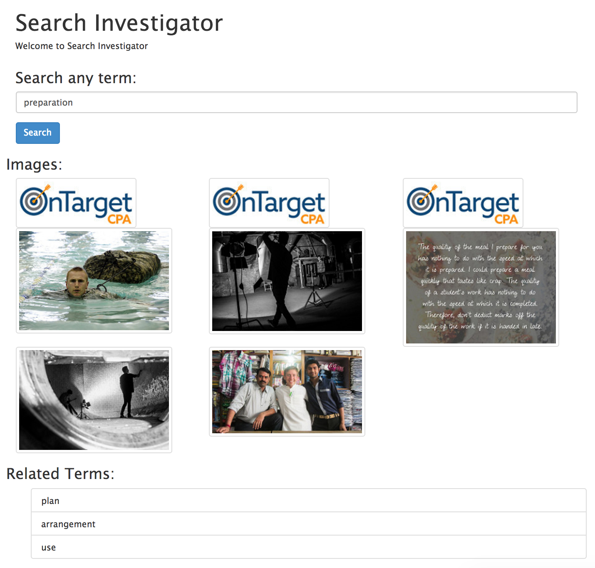

When you search for a word, it displays the images for that word and related words. The application is supposed to show related images, so that will be on the next revision.

[Github Project Page](https://github.com/jermspeaks/word-images)

### Technologies:

- AngularJS
- NodeJS
- ExpressJS
- Bootstrap

### Libraries:

- [X2JS](https://code.google.com/p/x2js/) - Flickr API outputs XML, and AngularJS is very JSON-centric, so I decided to convert the XML to JSON using this library. The XML data has proper headers, so no customization was needed.

### Data:

- Wordnik API
- Flickr API
