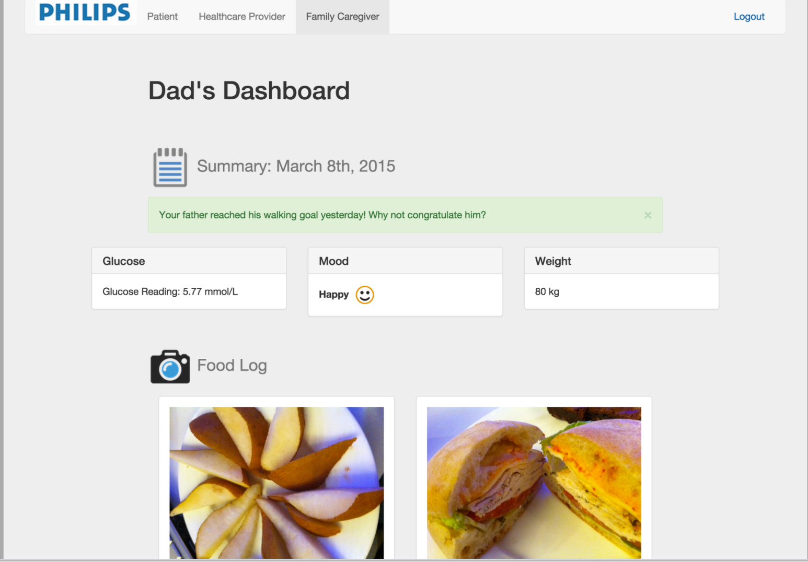

As part of the Philips HealthSuite Digital Platform Hackathon, I created a dashboard for my team for an app for geriatrics.
The goal was to combine the patient dashboard with his physician and primary care taker.
If you'd like to learn more, please check out the slides below.

## Slides

<iframe
  class="aspect-video w-full my-2"
  src="https://www.slideshare.net/slideshow/embed_code/key/3G3lq7HyN7WStE"
  title="YouTube video player"
  frameborder="0" marginwidth="0" marginheight="0" scrolling="no"
  style="border:1px solid #CCC; border-width:1px; margin-bottom:5px; max-width: 100%;"
  allowfullscreen></iframe>

  <strong>
    <a href="//www.slideshare.net/JeremyWong5/gerontech-wear-care-circle" title="Gerontech Wear: Care Circle" target="_blank">Gerontech Wear: Care Circle</a>
    </strong> from <strong>
    <a target="_blank" href="https://www.slideshare.net/JeremyWong5">Jeremy Wong</a></strong>

## Teammates

- Benay Dara-Abrams (Team Lead)
- Alec Dara-Abrams
- Julie Hui
- Philippe Furlan
- Jeremy Wong
