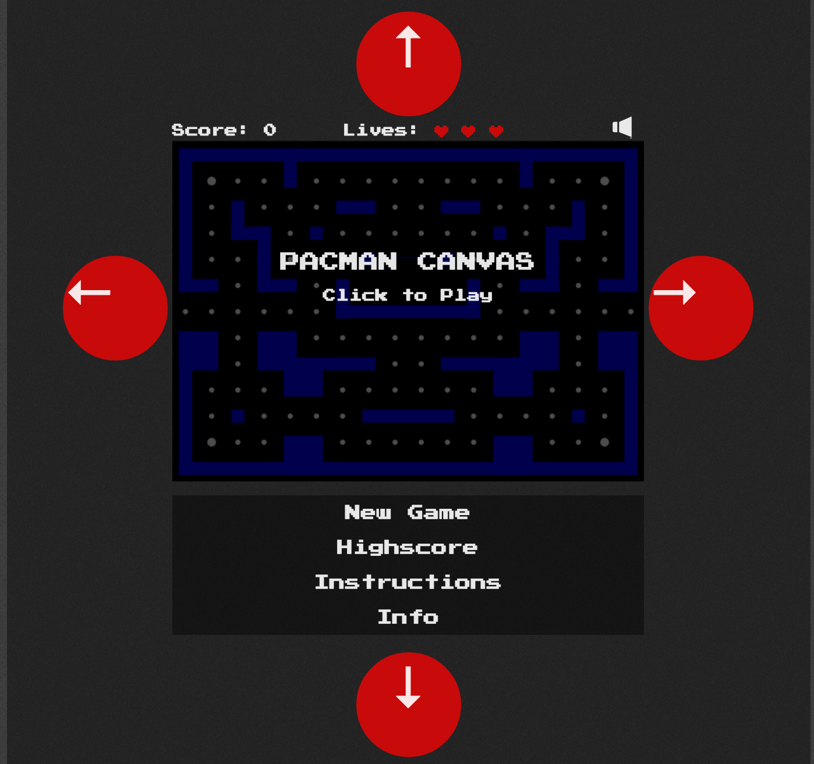

Neurogaming Hackathon 2015 - Pacman Project

Credits to [platzhersh](https://github.com/platzhersh) for [Pacman-Canvas](https://github.com/platzhersh/pacman-canvas).

### Technologies

- [OpenBCI](https://www.openbci.com/)
- Python
- Go
- Websockets
- Canvas
- Javascript

OpenBCI has a 4 Channel Inputs, with a 10/20 Scheme Placement

Steady state visually evoked potential. Induced by flashing lights. Frequencies: 8, 10, 12, 15 Hz

Initial Filtering with a Bessel Bandpass Filter (5 - 30 Hz), then goes through a Fast Fourier Transform (FFT)

Predictive Machine Learning Algorithm: Linear discriminant analysis (LDA), Training through calibration

Credit to “[Pacman Canvas](https://github.com/platzhersh/pacman-canvas)” by Platzh1rsch

SSVEP game controls, Websocket payloads input, Game controlled by flashing lights. Arrows indicate which direction. Flashing indicates the specified frequency associated with that direction

### Team

- [Hithesh Reddivari](https://github.com/Hitheshaum)
- [Kevin Schiesser](https://github.com/kevinjos)
- [Glenn Wright](https://www.linkedin.com/in/glenn-wright-ab8a501b/)
- Jeremy Wong
