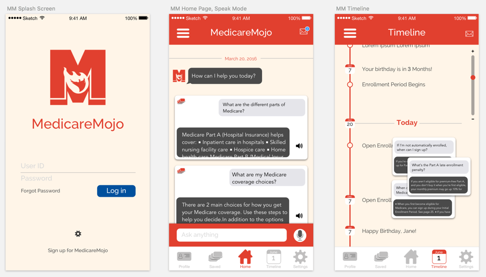

I wrote a backend for an application that utilizes IBM Watson to pick out topics from an article extractor. I ingested a medicare document to see if it could find the keywords.

[Github Project Page](https://github.com/medicaremojo/ibmhack)

<iframe
  class="aspect-video w-full my-2"
  src="https://www.youtube.com/embed/N-x-24C38Kk"
  title="YouTube video player"
  frameborder="0"
  allow="accelerometer; autoplay; clipboard-write; encrypted-media; gyroscope; picture-in-picture; web-share"
  allowfullscreen
></iframe>

## What we're up to

We're doing a pilot project for Bay Area soon-to-be-seniors who are enrolling in Medicare. We envision a time when consumers can sign up for Medicare, and know what they’ve signed up for and what is required of them. Everyone should be able to say:

- I’m in charge of my health care benefits.
- I have chosen the right plan for me.
- I can predict what I will be paying out of pocket, given different types of medical events.
- I know my rights and feel empowered when working with Medicare.
- I know I have complied with all rules and regulations.
- I have a community of friends and experts I can rely on.

We'll provide transparency and clarity for the consumer. We'll be launching in Sonoma, Napa, Solano, Contra Costa, Alameda, Santa Clara, Santa Cruz, San Mateo, San Francisco, and Marin counties.

We're [hacking away](https://devpost.com/software/medicaremojo-hieqj8) using IBM Watson APIs on thousands of documents. And when we say "we", we mean:

- Benay Dara-Abrams (benayda)
  Working in intersection of Cognitive Computing, Data Science, and Digital - Health & Wellness
- Faustine Huynh (fnhuynh)
  UX Designer and Researcher
- Jeremy Wong (jermspeaks)
  Front-end Engineer @Inform, Runner, Writer: https://t.co/FrbTIvWqGP
- Jonathan Tsay (JonTsay)
  "life has really come together around User Experience design"
- JuLee Burdekin (theship)
  product design, webdev, data wrangling, and anything else that's needed on a - project
- Alec Dara-Abrams (adaongithub)
  consultant
