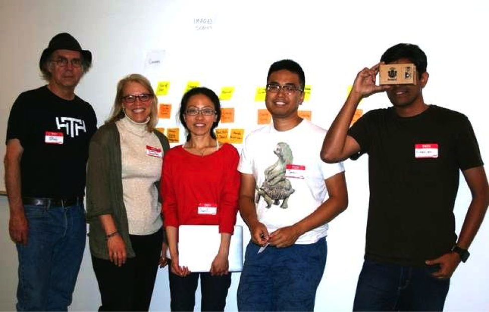
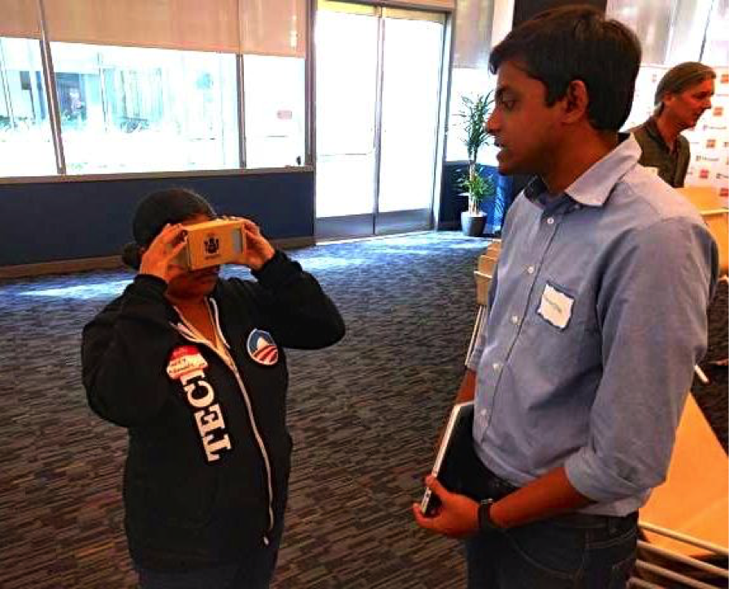
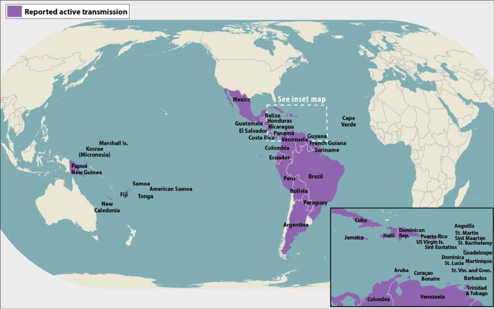
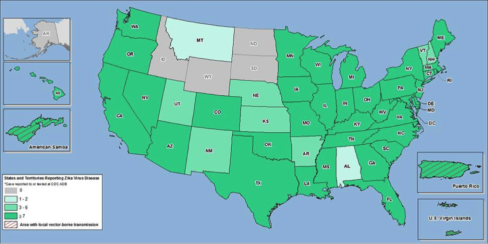
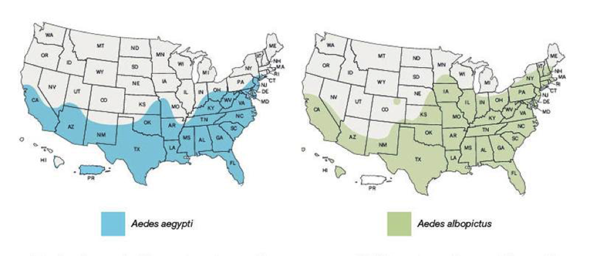
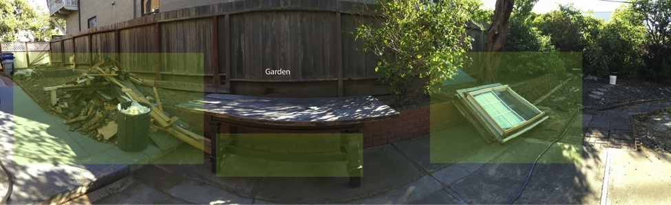

## Introduction

_The following is taken from the [Zika VR Website](https://zika-vr.github.io/)_

As part of National Day of Civic Hacking 2016, we formed a team that created a
virtual reality prototype to enable the public to better learn about the Zika
virus--the nature of the pathogen, its health consequences, potential breeding
grounds of Zika infected mosquitos, and effective Zika prevention techniques.

As has been profiled in the press during the past year, Zika is a mosquito
borne virus that is implicated in very serious birth defects found in a
percentage of infected pregnant women--including microcephally, which results
in stunted brain development of the baby and an abnormally small head size. In
addition, Zika infection is now believed to be associated with a percentage of
Guillain-Barré syndrome cases, an autoimmune disease of the nervous system,
occurring in both men and women.

The World Health Organization has estimated that by the end of 2016, at least 4
million people will become infected with Zika. The below map highlights current
global areas of Zika infection.

There are currently no Zika cases in the US that were acquired domestically. US
infections have so-far been found only among those who have traveled to Zika
countries and then returned home. But these domestic numbers are not insig-
nificant--with over 1,300 total. NY state alone currently has 339 cases, and
Florida has 229. And since Zika can be spread by mosquitos biting an already
infected person, as well as through sexual contact with
an infected partner, the public health concern is real.

And since Zika already exists in Mexico, it is a given that the Aedes mosquito
will eventually reach the US. Below is the CDC's estimate of the likely domestic
spread of the two Aedes mosquito species.

## Zika Prevention and Protection

There is no current vaccine for Zika. Thus, the key preventive measures against infection lie in controlling the breeding and spread of the Zika-carrying mosquito, and in protecting against mosquito bites.

Mosquitos lay their eggs and breed in areas of standing water, such as:

- Vases
- Buckets
- Planters
- Children's toys
- Birdbaths
- Flower pots
- Pool covers
- Discarded tires
- Construction site containers/tarps

Key protective measures for avoiding mosquito bites include:

- Window screens
- Bed nets
- Fans/AC
- Long sleeve shirts/pants
- Insect repellant
- Avoiding the outdoors during early morning/late afternoon hours

## The VR Component

The current excitement around Pokemon Go demonstrates the growing public
familiarity with the technologies of Virtual Reality and Augmented Reality. And
the $15 Google Cardboard viewer, teamed with popular iPhone/Android
smartphones, has greatly eliminated previous economic barriers around
experiencing VR.

The United Nations has recently employed VR filmmaking as a cutting-edge tool
for public awareness and fundraising around such global concerns as Climate
Change and the Syrian refugee crisis. Such VR offerings provide a compelling,
immersive, and visceral experience that surpasses either textual tracts or film
clips--placing the viewer there in a given setting, and providing a lasting and
emotional learning experience. With VR, passive viewers become active
participants.

We believe that the engaging and empathetic aspects of VR being employed by the
UN around global crises can also be leveraged in terms of public health--not
only with the current spread of the Zika virus, but with future infectious
public health emergencies. Our Zika prototype places the participant in a
familiar home and neighborhood setting, enabling them to experience first-hand
the places that Aedes mosquitoes breed, and the protective measures that can
guard against mosquito bites--providing a lasting "emotional-memory" that
transcends traditional public health bullet points or infographics.

Once our application is live, we would like to partner with airports (travel
hubs to and from Zika areas), libraries, schools, local public health
departments, and public gathering places such as malls. The obvious coolness
factor of VR is a clear draw in such settings. And since the upcoming 2016
Summer Olympics is taking place in Rio, the event could provide an ideal media
vehicle to highlight our application. (There are currently over 26,000 reported
cases of Zika in the state of Rio de Janeiro.)

## The Future

### Our future plans for the application include:

- Higher-quality VR imagery
- Audio sound-effects
- Gamification (allowing scoring/temperature-coloring for locating pertinent
  mosquito breeding areas and mosquito protective measures
- Pop-up text-based content associated with given objects

### What We Are Looking For

- Programmers familiar with VR
- Testers
- UI Designers
- Community Partners/Connections
- Public Health Department Partners/Connections
- International Partners/Connections
- Media Liasons
