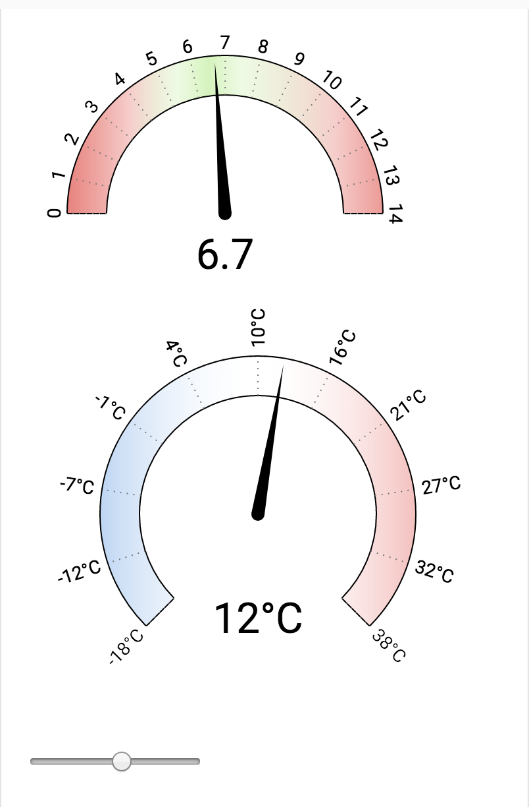
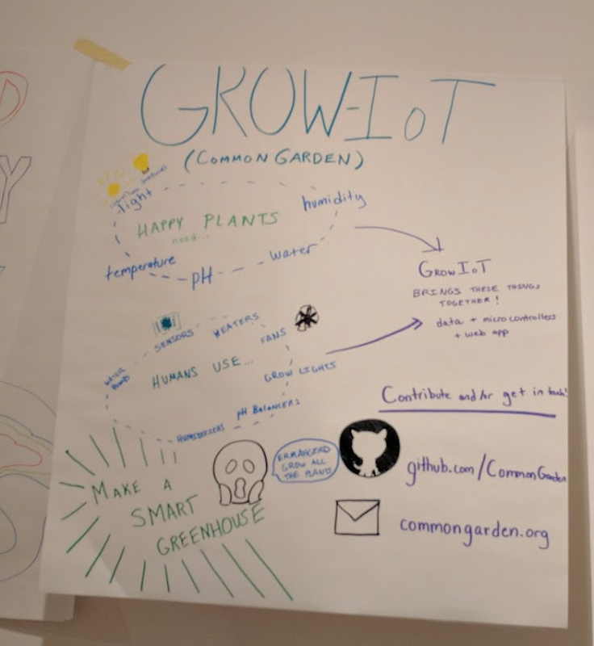

At the 2016 Science Hack Day in San Francisco, I teamed up with [Jake Hartnell](https://commongarden.org/) who has built modules for his gardening open source start-up.
I thought it might be fun to take those components and build a smart composter.

## Things you will need

- Composting bin
- water pump
- temperature probe
- ph probe

## Dashboard

I also helped Jake integrate d3 charts with his Polymer app.

[Github Page](https://github.com/CommonGarden/grow-elements)

## Documentation

## Ongoing Progress

Last Updated April 17th, 2017

I'm reading through Rodale's Composting book.
I'm trying to determine which sensors are the most important to keep on the prototype.
Then I'm buying those sensors and working with a colleage to put it together.
The end goal is to draft a document on how to do this on Instructables.
