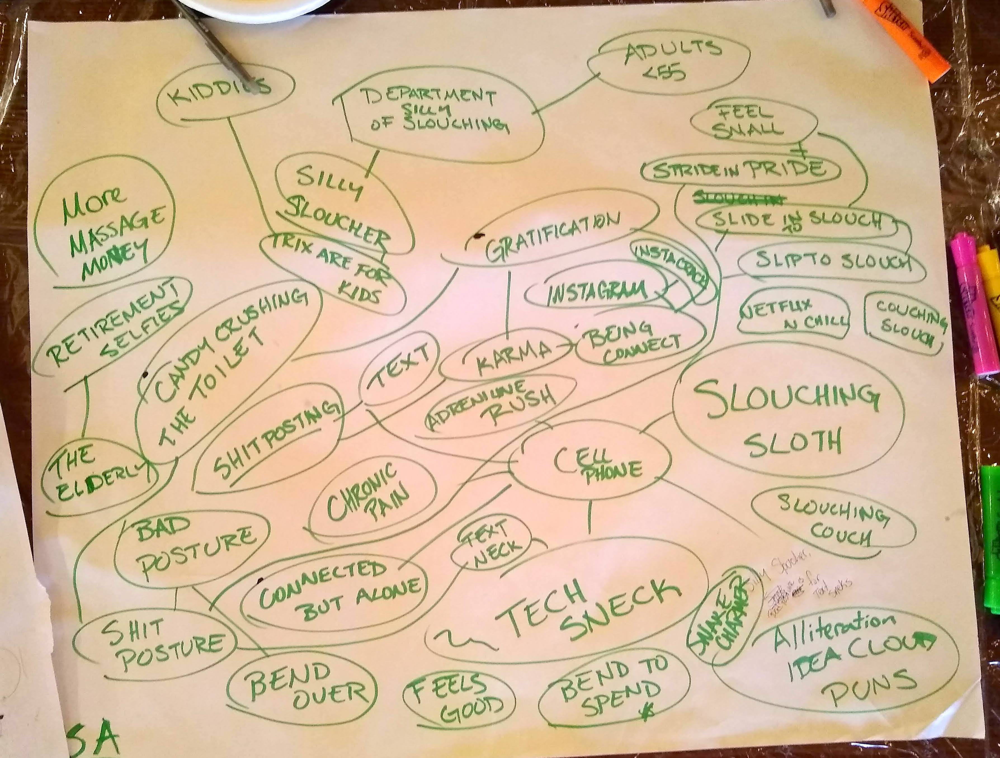
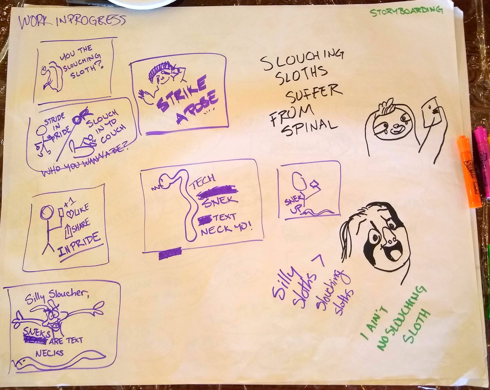
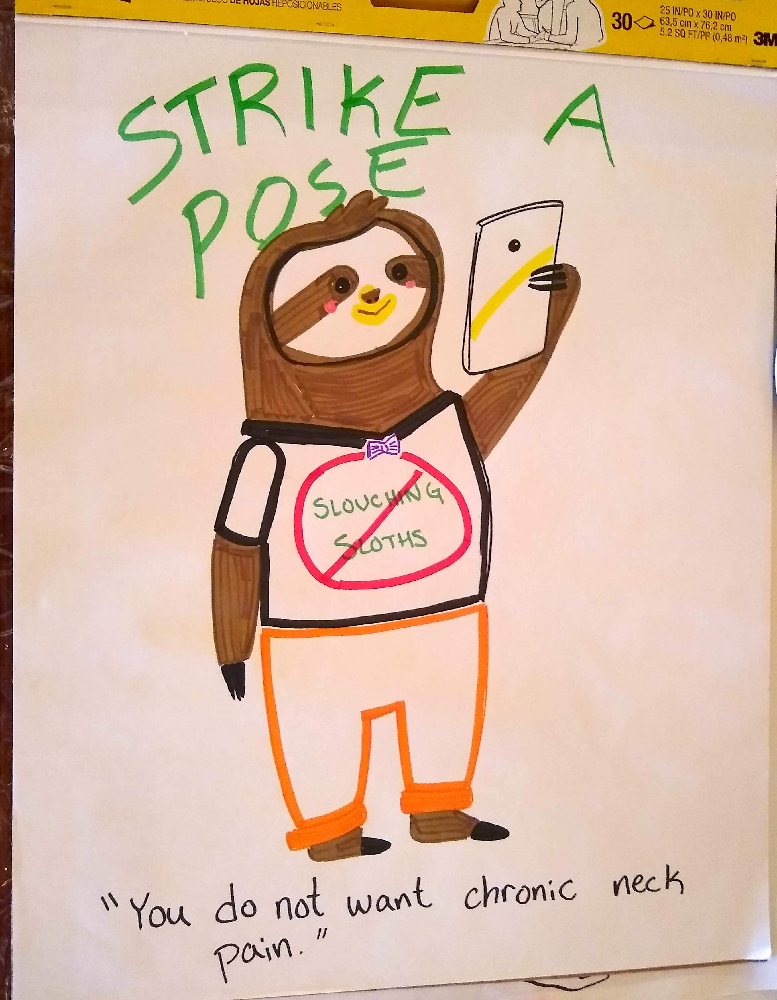

[Science Hack Day SF 2018 Project](https://sf.sciencehackday.org/hacks-2018/#hack_5)

## Phone Use and Chronic Neck Pain PSA

_Goal:_ Create a fun way to make people aware of phone use and chronic neck pain

### Ideation Phase

### Storyboarding Phase

### First Drafts

## Credits

Ideation and Illustrations - Jeremy Wong
Graphic Design Consulting - Lee McGirr
Help From - Riccardo Guidi
