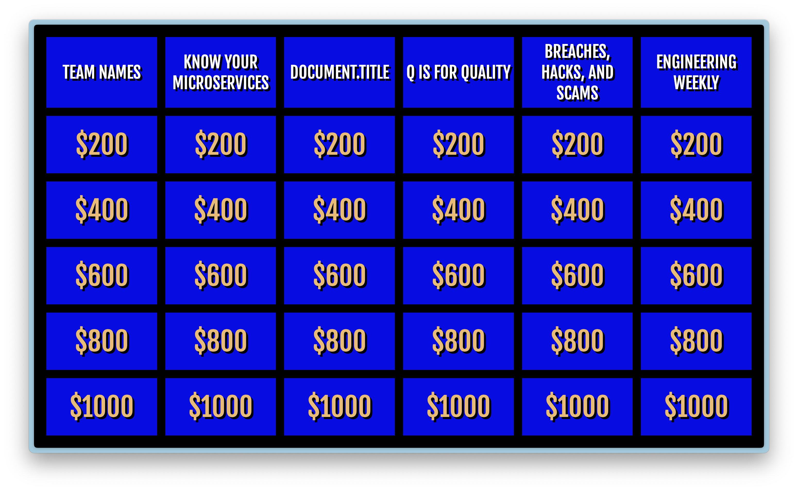

[GitHub Repo](https://github.com/jeremy-clearlabs/jeopardy-svelte)

During these COVID times, everything has been moved online, including our holiday parties.
I was asked to build a team event, so I decided to build Jeopardy using Svelte.

I've fallen in love with [Svelte](/blog/2024-02-08-svelte/), so I thought I would
take what I learned from the tutorial to a project.

I never played a Jeopardy video game, so I developed my own game rules based off
the television show.

- There will be three rounds
  1. Jeopardy
  2. Double Jeopardy
  3. Final Jeopardy
- There will be three main players
- The person sharing their screen will be the score keeper
- Players can gain or lose points (money)

In practice, I needed a much, much better score keeping system and timer.

I pre-seeded the questions in. I feel like a future endeavor could be to seed
previous jeopardy games.

The website is [still live](http://jeopardy-svelte-git-main.jeremy-clearlabs.vercel.app/), so try it out!

