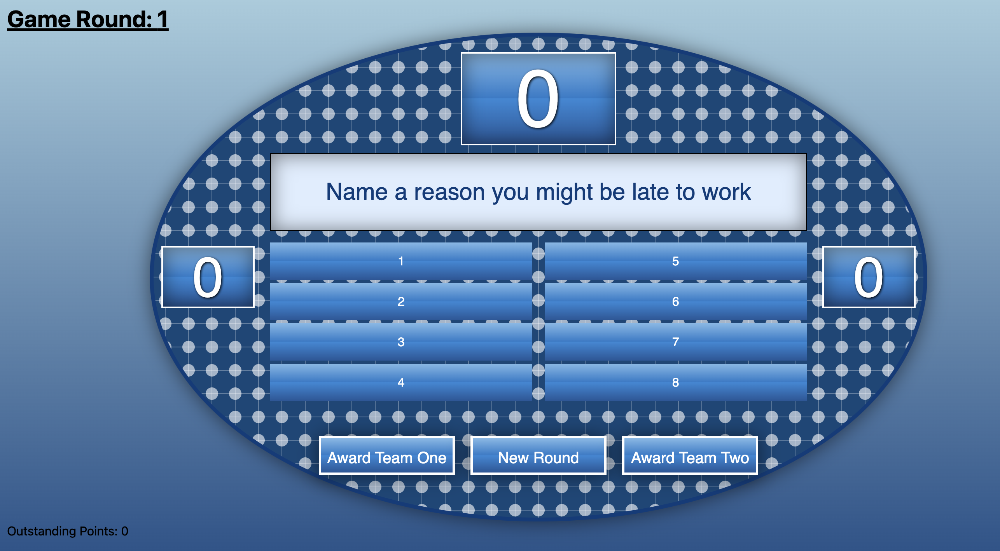

[GitHub Repo](https://github.com/jeremy-clearlabs/clearly-feud)

I made this as part of a lunch and learn at Clear Labs on how to develop software. Here's the presentation in website format.

### Agenda

The key concepts we will review:

- Requirements
- User Stories and Wireframes
- Architecture
- Coding
- Testing
- CI / CD

And a little inspiration…

### Requirements

Before beginning any program, you have to get the parameters.
If your program is a block box, define your inputs and outputs (I/O)
Consider talking to your customers. You’re building a program for end users. If you are the end customer, define what you want it to be

### User Stories and Wireframes

When you have defined requirements, then you can define user stories.
User stories define a single user doing a specific task.

> As a customer, I can add an item to my cart.

Tangentially, you will want to understand your user by crafting a user persona. This includes specifics about your end users, including demographics.
With the user stories defined, you can craft lo-fi mockups, or wireframes

### Architecture

With your requirements defined, your user stories and wireframes determined, you are ready to determine your architecture.

> How will you build the system?

> Are there major changes to our system?

### Coding

Implementation!

You construct programs to solve your requirements.

For Clear Feud, it was creating a UI that can play the game.

Git - Version Control

==Demo: IDE==

### Testing

Validation: Did it work according to your requirements?

Verification: Did you build the right thing?

- Static Tests
- Unit Tests
- Integration Tests
- End to End Tests

These forms of testing have low to high costs (in respective order)

### CI/CD

- CI = Continuous Integration
- CD = Continuous Deployment

There are plenty of services that do each of these. They serve your operational purposes.
For Clear Feud, we are using Vercel.

### Game Mechanics

There are two teams. Points are awarded to the teams with the right answer.
We seeded the questions prior to the game starting.

The website is [live](https://clearly-feud.vercel.app), so try it out!

This app was built with [Create React App](https://create-react-app.dev/).

