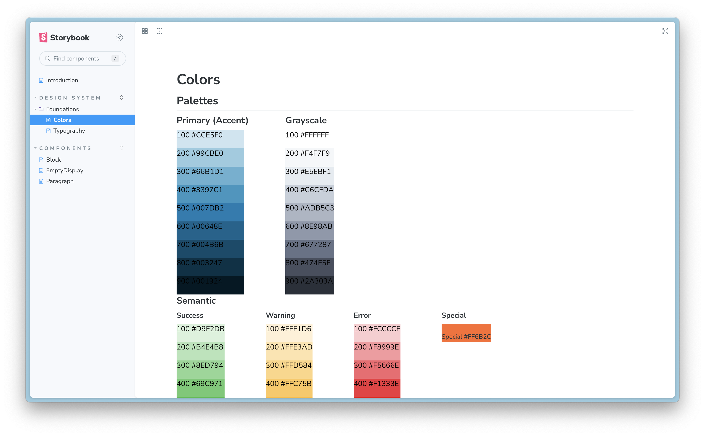

- [GitHub Repo](https://github.com/jermspeaks/clear-component-library)
- [Storybook Documentation](https://clear-component-library.vercel.app/)

This was built with Vite + React + Styled Components. The library is shown through example from `styled-components`.

The idea I had in mind was to upgrade our current React stack with something more modern.

While I was still using some older techniques for styling, I decided to go full in on GitHub Actions
and vercel for showcasing our component library.

At some point, I want to extend this for all of our custom components.
