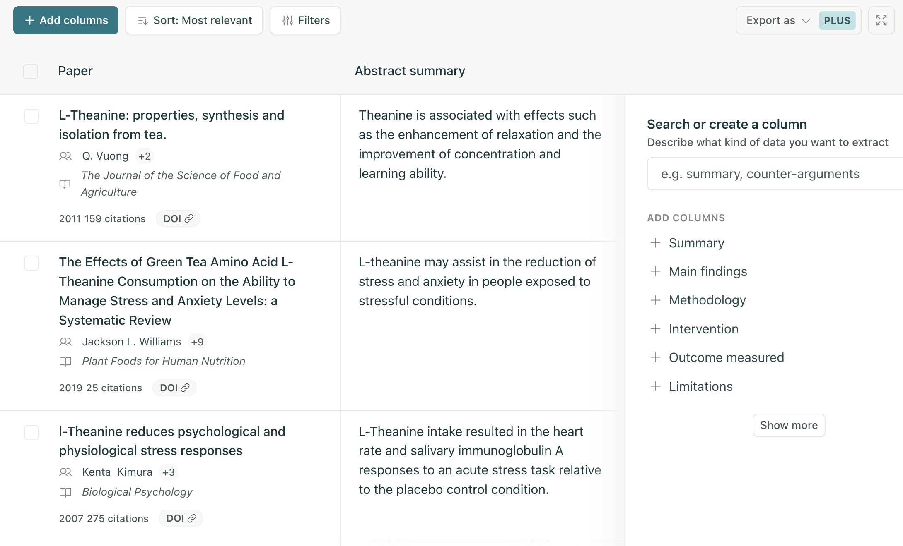

I got a chance to play around with Elicit and was reading through Adam Wiggin's
[Tweet](https://twitter.com/_adamwiggins_/status/1778071478610850069). I think
I might make a quick web app trying multi-column queries about a particular
topic and allow more of a computational style of conversational chat.

