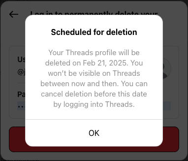

I've had it. The last time I logged into Instagram, there were a couple of right-wing organizations recommended to me. I don't care if it's [a glitch](https://www.bbc.com/news/articles/c4g32yxpdz0o), it's not acceptable. If a CEO tries to be someone you can't understand or respect, it's time to leave.

import LinkPreview from "../../components/LinkPreview.astro";

<LinkPreview
  url="https://www.bbc.com/news/articles/c4g32yxpdz0o"
  title="Instagram hides search results for 'Democrats'"
  image="https://ichef.bbci.co.uk/news/1024/branded_news/ec0a/live/645e61b0-d7ee-11ef-b4b9-cb08e2f4af3d.jpg"
  description="Meta says it is working quickly to resolve the problem, which has prompted accusations of bias on social media."
  size="sm"
/>

This is my decision to leave Facebook, Threads, and Instagram. It's been years on these apps, and it's time for a farewell.

### Caveat

I am still on Whatsapp due to communication with some friends who haven't left that platform yet. I fear Facebook has such a monopoly on there, and I realize such drastic measures are hard to keep when it comes to cutting off ties with everyone.
