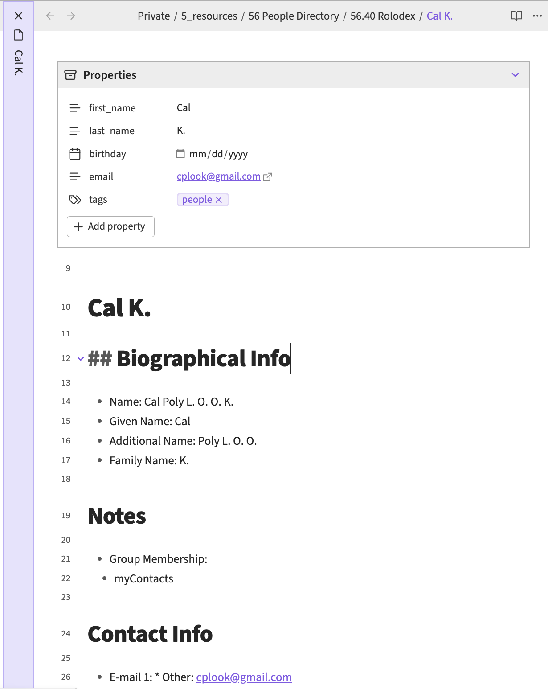

My mom used to use a rolodex to keep track of her customers. She owns a hair salon, and she kept a single index card per customer with their name, phone number, and how often they visited. The analog solution made it simple to keep track of these customers, but the biggest pain was retrieving that information.

While I don't run my own hair salon, I wanted to have my own version of the rolodex. Some people call this a personal CRM, but I never liked the marketing and sales analogy as that's not the relationship I have with people. In Obsidian, I have a folder called "Rolodex" where each note has a person's details, like a dossier. Through other notes, I'll record interactions I've had with that person. Not every interaction of course, as that would make the system far too tedious.

I imported my contacts over from Google Contacts. I created a script to take a Google sheet export of those contacts and tidy up the information. Of course, I still have to go through and delete contacts who are actually not contacts. And I don't mind having "weak" contacts as it helps color my notes a lot more when I had a one-time collaboration with them. Also, since Obsidian is bi-directional, I can connect people to each other.

I generally keep a map of contacts in a "map of content" or index of specific groups, like co-workers, activity groups, and close friends. This allows different connections to form for each segment type. Like periodic check-ins. For closer friends, I'll reach out at least once a year if I have their birthday. Or remember I have to ask when their birthday is.

## Future Improvements

- How do I sync updates in my contacts?
  - From my Contacts app?
  - From updates in social media?
- What is worth recording?
