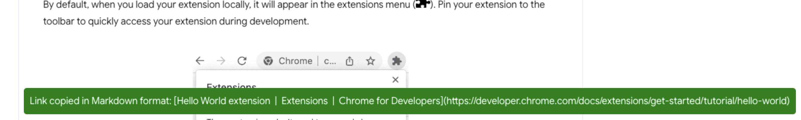

I keep a list of projects I want to work on called "Someday Builds".
Many of these are bespoke apps that I know could help me, like an automation.
However, automations take time to build, and typically I'll be able to finish
that task far faster than I can build the automation to reduce that overhead.

Case in point, I wanted to build a chrome extension that by running the
extension, the clipboard takes the head title and the full, cleaned link,
and copies it in markdown format. The reason I want this is to add quick links
to my daily notes without having to find the title of the article, put it in
the markdown format, grab a clean link, then add that to the parentheses in the
markdown format. Also, Obsidian loves to grab headings, so I will get a # symbol
for the description of the link. It's a few extra keystrokes, and really not 
worth the efforts (about an extra few seconds of my day, plus some extra effort).

Of course, the time to build is reduced to an hour of work with the help of
ChatGPT.

## Prompt

> I want you to act as a programmer. You have a deep knowledge of writing chrome extensions and understand the best practices. I will provide the purpose of the application and a feature set. If there are any ambiguities in the features, please pause in the next step and clarify questions using a numerical list format. Next, you will come up with the basic outline for the code as pseudocode before writing the program. The next message you will ask me is what the feature set is.
>
> Want to build a chrome extension that by running the extension, the clipboard takes the head title and the full, cleaned link, and copies it in markdown format.
> The chrome extension takes the webpage metadata and extracts the title. Then, it takes the URL. The output should be a string that is copied to the clipboard in markdown format as follows `[Title](Link)`. I want the link to be clean, so no url queries like `utm` should be added. We can also register a shortcut that can trigger the extension. There should be a settings menu to modify this shortcut. Also, the settings menu should have a modifier for the output format. The name of this extension should be called "Copy Link to Markdown".

## Installing the Chrome Extension Locally

It's been awhile since I've done this, so I Google searched an article to help me.
I used the Chrome dev team's [hello world extension](https://developer.chrome.com/docs/extensions/get-started/tutorial/hello-world) as a guide.

## Developing the Extension

The first generated codebase did not work. Of course, my prompt above says to pseudocode it first, which was a struggle because there were actual code snippets with a bunch of comments where the code should be. So I had to continue prompting it to give me the final code.

After about 15 minutes, I got the code working. That was after passing it back and forth a few errors and working through those one at a time. Then I saw opportunities everywhere of what I wanted it to do next, as well as places I knew where the codebase needs to be refactored.

I made it generate an image for the extension icon.

For whatever reason, the extension shortcut key needed to be set differently, so
I had to use a different menu for that.

## Final Thoughts

I placed the extension on [Github](https://github.com/jermspeaks/chrome-extension-markdown-link) where you can play with it today. There's a lot more work I need to do to make this extension publishable. But for a v1, it's good enough.

The total development time was a little over an hour, and I'm happy about that because I'm already using it. And I can tell it makes a huge difference because I save links all of the time in my daily notes.
