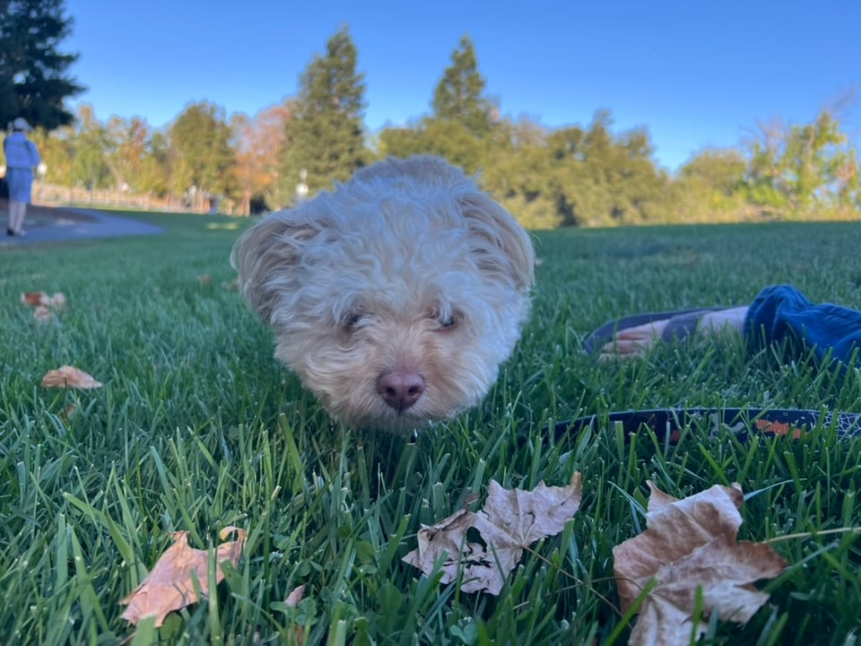

📍 Location: Bay Area, CA

An anxious election day to you too. A follow-up from my last newsletter, Morgan and I closed on our home towards the end of this past month, and we couldn’t be happier.

The whole process has been a whirlwind. I have a ton of notes that I will eventually put into a blog-style post. Hopefully, after we wrap up the chaos of moving.

We are starting to feel the neighborhood spirit. One of the big conversations I had with Morgan is finally having a place of belonging. I have moved 5 times in the last 5 years, and frankly I’ve had enough. And every place I’ve moved to, the neighbors sure haven’t been too friendly or chatty. In the last apartment, there are familiar faces, but most leave before making a long impression. With this card, we are hoping to be friends with some of our neighbors.

The cold air is finally here in the Bay Area. And with that, I leave you with our little puppy.

Ciao!
